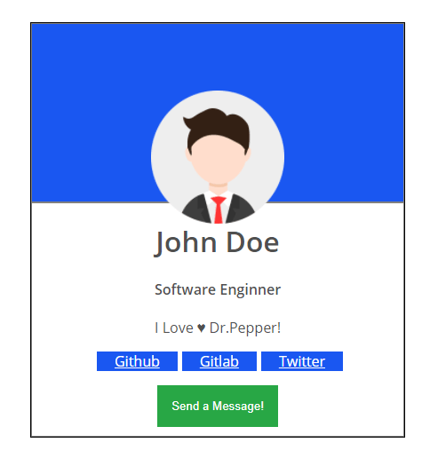

# Profile Card Web Component



### Install

```

npm install

```

### Run Tests

```

npm run test

```

### Run Demo

```

npm run demo  //or

npx web-dev-server -c server.config.mjs

```


## Usage


#### Properties

| Property              | Type        | Default   |
| --------------------- | ----------- | --------- |
| first-name            | Text        |           |
| last-name             | Text        |           |
| job-position          | Text        |           |
| about-me              | Text        |           |
| photo-url             | Text        |           |
| primary-color         | Hex or Text |   gray    |
| secondary-color       | Hex or Text |   white   |
| font-color            | Hex or Text |  #505050  |
| github-url            | Text        |           |
| gitlab-url            | Text        |           |
| twitter-url           | Text        |           |
| call-to-action        | Text        |           |
| @call-to-action-click | Function    |           |


#### Slots

| Name                 | 
| -------------------- |
| first-name           |
| last-name            |
| job-position         |
| about-me             |


##### TODO
1. Include CSS file into web component
2. Test Slots 
